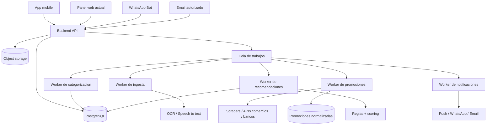
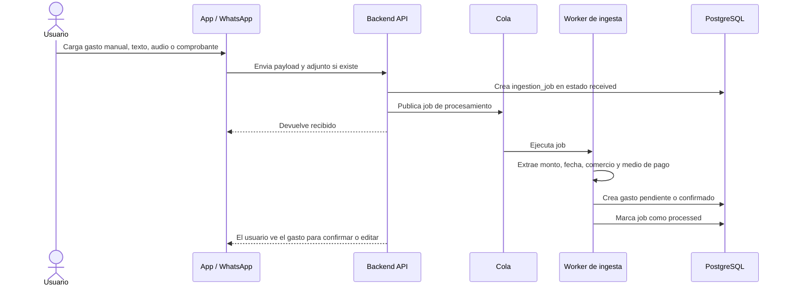
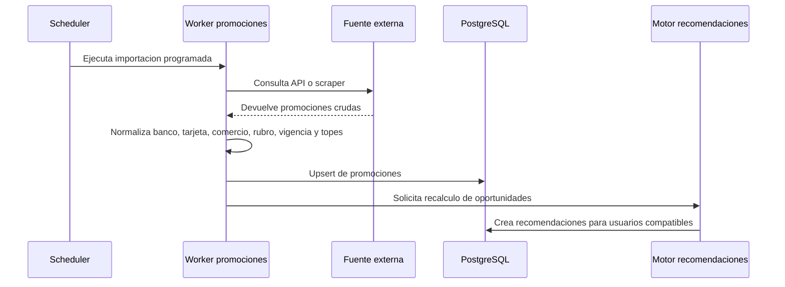
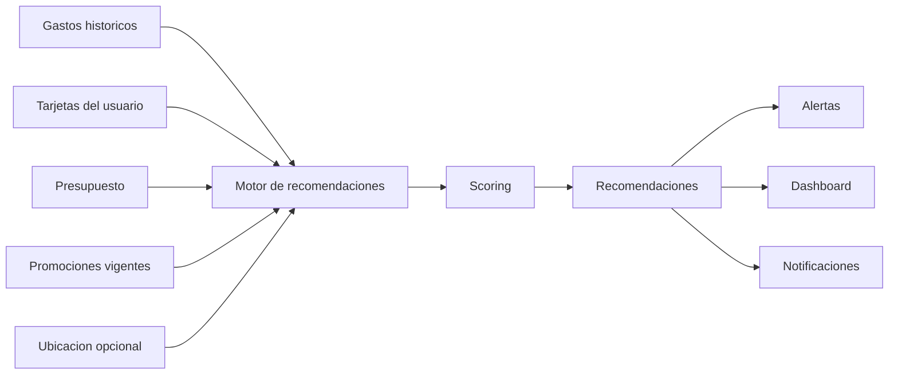

# Arquitectura objetivo - CapsaAI

Este documento describe la arquitectura objetivo para evolucionar la maqueta actual hacia un producto real de gestion de gastos, promociones y recomendaciones financieras para usuarios en Argentina.

## Criterio de arquitectura

Para el alcance inicial no conviene partir con microservicios completos. La escala declarada es baja: 100 usuarios y 30 transacciones por usuario por dia. La complejidad esta en la ingesta, normalizacion y recomendacion, no en el volumen.

La recomendacion es usar:

- App mobile como cliente principal.
- Backend modular con API HTTP.
- Base de datos relacional.
- Workers asincronicos para procesos lentos.
- Servicios externos aislados detras de adaptadores.

## Vista general

## Modulos internos

| Modulo | Responsabilidad |
| --- | --- |
| Identidad y usuarios | Registro, login, perfil, baja de cuenta, consentimiento de permisos. |
| Seguridad | Autorizacion por usuario, permisos de grupos, auditoria, cifrado y retencion. |
| Gastos | Alta, edicion, baja, consulta, filtros, adjuntos y duplicados. |
| Tarjetas | Alta, edicion, baja, banco, marca, ultimos digitos, beneficios aplicables. |
| Categorias | Categorias base, reglas por comercio, aprendizaje por correcciones del usuario. |
| Presupuestos | Limites mensuales y por categoria, avance, desvio y alertas. |
| Dashboard | Resumen, evolucion temporal, categorias, tarjetas, suscripciones y proyeccion. |
| Calendario | Distribucion diaria de gastos y detalle por dia. |
| Promociones | Importacion, normalizacion, vigencia, comercio, banco, tarjeta y restricciones. |
| Recomendaciones | Oportunidades de ahorro, optimizacion de consumo, deteccion de habitos. |
| Notificaciones | Push, WhatsApp o email segun preferencias y reglas anti-spam. |
| Grupos | Gastos compartidos, miembros, saldos y liquidaciones. |

## Workers recomendados

Los workers permiten cumplir el requisito de carga menor a 3 minutos sin bloquear la app.

| Worker | Entrada | Salida |
| --- | --- | --- |
| Ingesta de comprobantes | Imagen, PDF, audio o texto | Gasto pendiente de confirmacion. |
| Categorizacion | Gasto sin categoria o categoria dudosa | Categoria sugerida y confianza. |
| Promociones | Fuente externa o scraper | Promociones normalizadas y vigentes. |
| Recomendaciones | Gastos, tarjetas, promociones, presupuestos | Recomendaciones priorizadas. |
| Notificaciones | Alertas y oportunidades | Mensajes enviados o programados. |

## Flujo de carga de gasto

## Flujo de promociones

## Flujo de recomendacion

## Decision sobre inteligencia artificial

No es necesario entrenar un modelo de deep learning para el MVP. Con 100 usuarios no habra suficiente dato propio para entrenar un modelo robusto.

La evolucion recomendada es:

| Etapa | Tecnica | Casos cubiertos |
| --- | --- | --- |
| V1 | Reglas y estadistica | Presupuestos, alertas, recurrentes, promociones por tarjeta. |
| V2 | ML simple | Categorizacion, proyeccion, deteccion de anomalias. |
| V3 | Modelos avanzados | Optimizacion personalizada y ranking avanzado de recomendaciones. |

## Servicios externos posibles

| Necesidad | Opciones |
| --- | --- |
| WhatsApp | Meta WhatsApp Cloud API, Twilio, Zenvia. |
| OCR | Google Vision, AWS Textract, Azure Document Intelligence. |
| Audio a texto | OpenAI Whisper API, Google Speech-to-Text. |
| Email | Gmail API, Microsoft Graph. |
| Push notifications | Firebase Cloud Messaging, Expo Push. |
| Ubicacion/mapas | Google Maps, Mapbox, OpenStreetMap. |
| Storage | S3, Cloudflare R2, Google Cloud Storage. |
| Jobs/colas | BullMQ + Redis, Cloud Tasks, SQS. |

## No funcionales refinados

| Requisito | Especificacion propuesta |
| --- | --- |
| Aplicacion mobile | El cliente principal debera estar disponible en iOS y Android. |
| 100 usuarios | El sistema debera soportar al menos 100 usuarios registrados. |
| 30 transacciones por usuario por dia | El sistema debera soportar al menos 3.000 transacciones diarias totales. |
| Carga menor a 3 minutos | Toda ingesta asincronica debera pasar a estado procesado o fallido antes de 3 minutos. |
| WhatsApp como canal de carga | El sistema debera permitir registrar gastos via WhatsApp con confirmacion del usuario. |
| Datos seguros | Autenticacion segura, autorizacion por usuario, cifrado en transito, cifrado de datos sensibles en reposo, auditoria y borrado de datos. |
| Argentina | Moneda ARS, zona horaria argentina, bancos/comercios argentinos y telefono con prefijo +54. |

