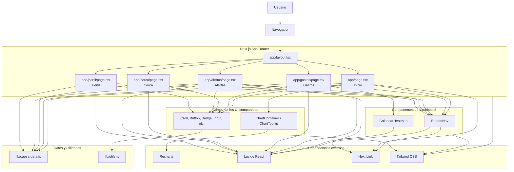

# Diagrama de componentes - CapsaAI

Este diagrama muestra la organizacion actual de la app: paginas de Next.js, componentes compartidos y fuente de datos local.

## Responsabilidades principales

| Componente | Responsabilidad |
| --- | --- |
| `app/page.tsx` | Dashboard inicial: resumen mensual, proyeccion, categorias, tarjetas, suscripciones y accesos rapidos. |
| `app/gastos/page.tsx` | Vista de gastos: estadisticas, calendario, categorias y transacciones recientes. |
| `components/dashboard/calendar-heatmap.tsx` | Calendario interactivo con filtros por categoria/tarjeta y detalle diario. |
| `app/alertas/page.tsx` | Listado de alertas priorizadas y acceso a revision de transacciones. |
| `app/cerca/page.tsx` | Promociones cercanas y recomendacion de tarjeta. |
| `app/perfil/page.tsx` | Presupuesto, tarjetas vinculadas, preferencias y privacidad. |
| `components/dashboard/bottom-nav.tsx` | Navegacion principal entre secciones. |
| `lib/capsa-data.ts` | Datos mockeados, categorias y funciones de formateo. |

