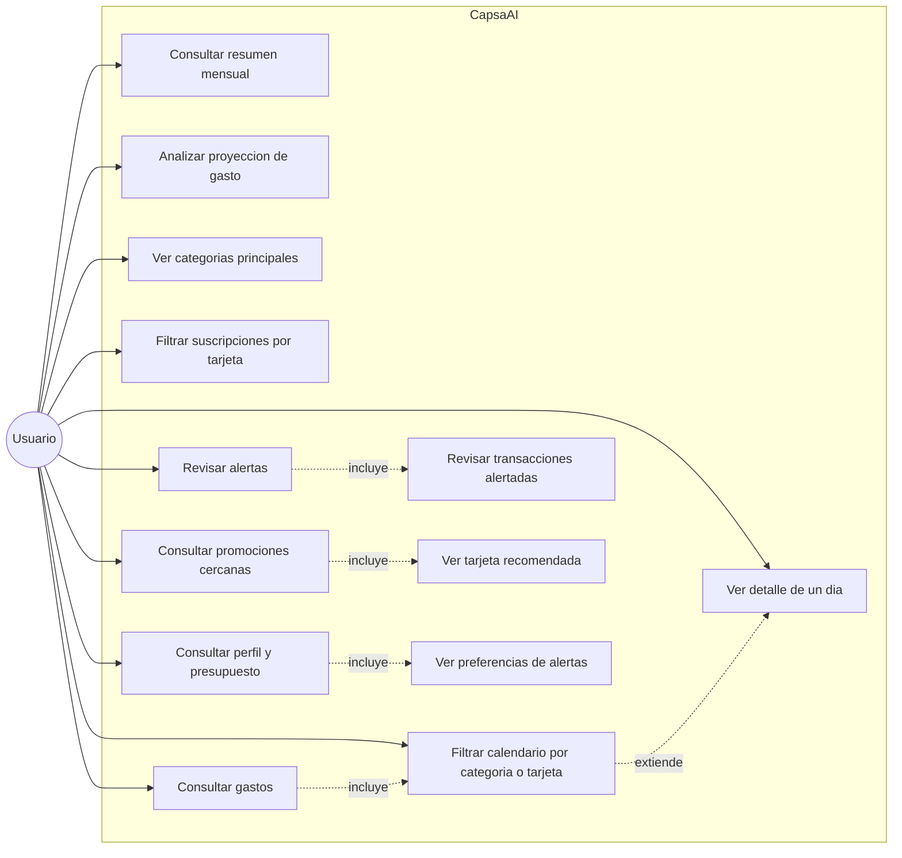
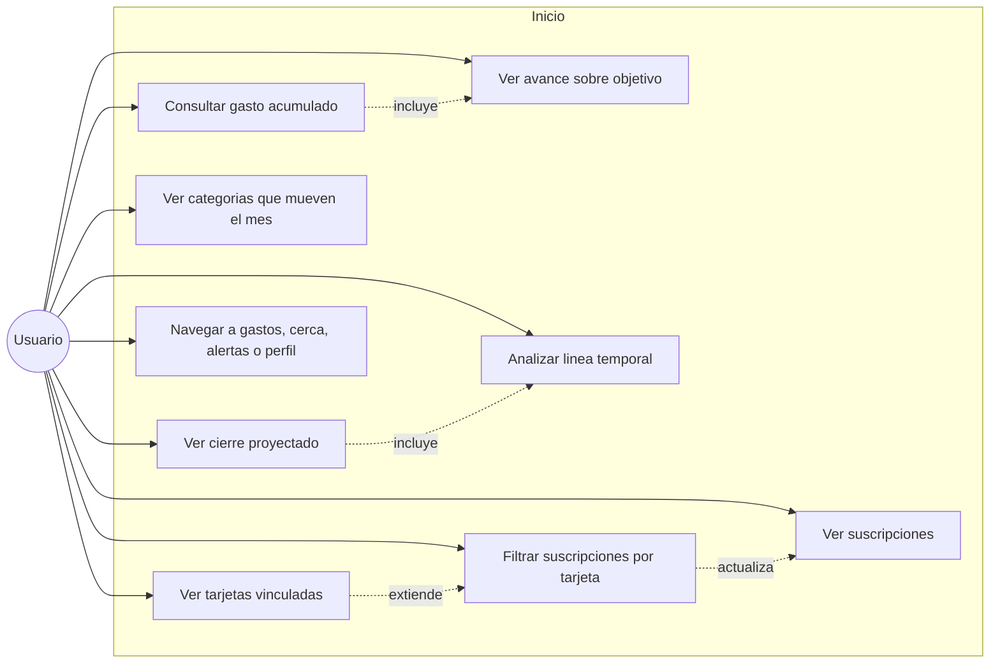
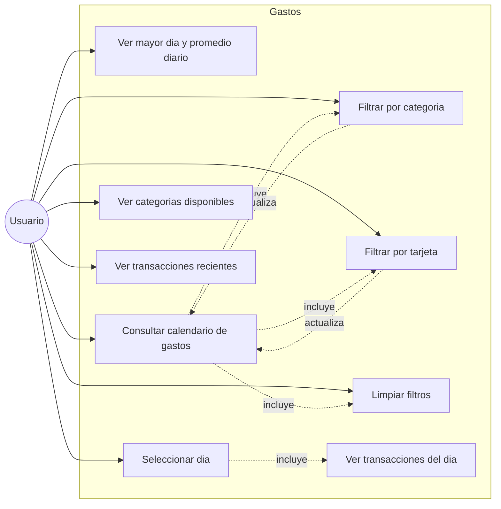
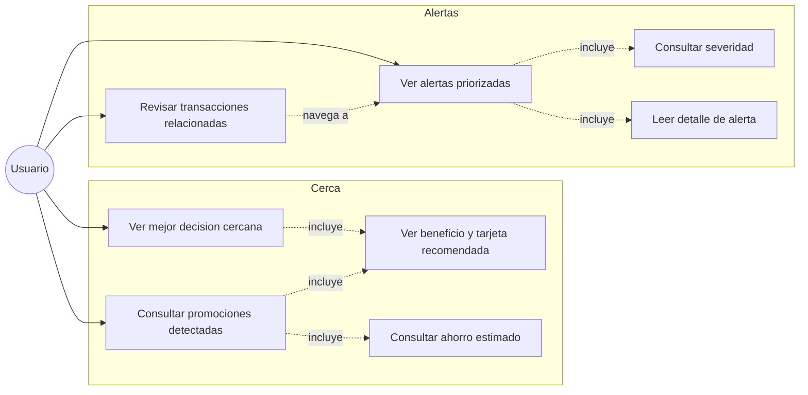
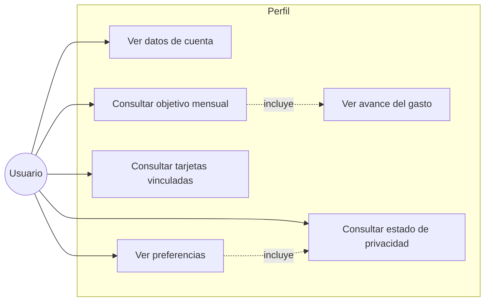

# Diagramas de casos de uso - CapsaAI

Estos casos de uso describen lo que puede hacer el usuario con la version actual de la app.

## 1. Vista general del sistema

## 2. Casos de uso del dashboard

## 3. Casos de uso de gastos

## 4. Casos de uso de alertas y promociones

## 5. Casos de uso de perfil

