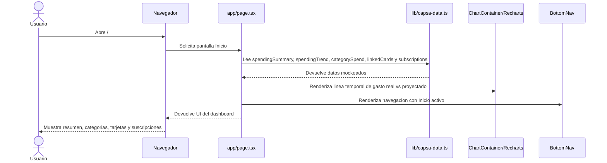
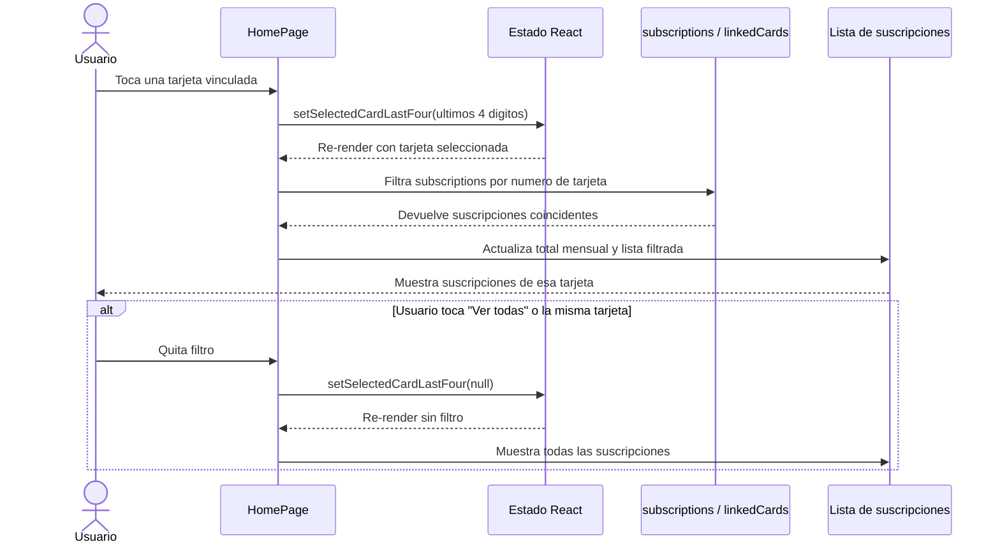
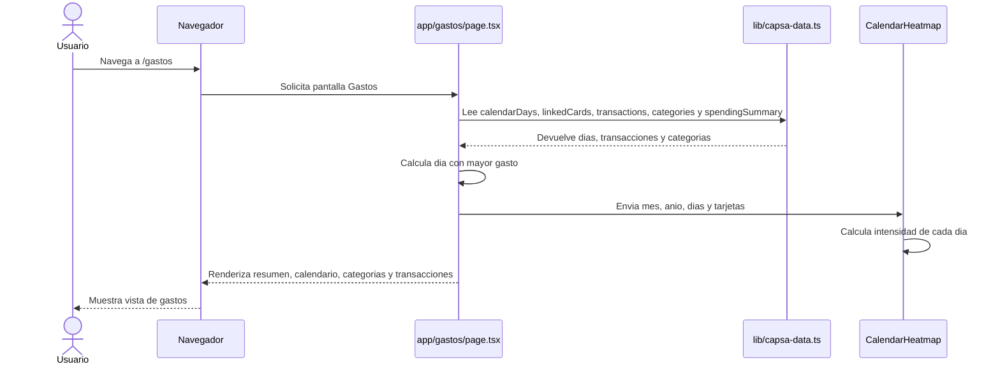
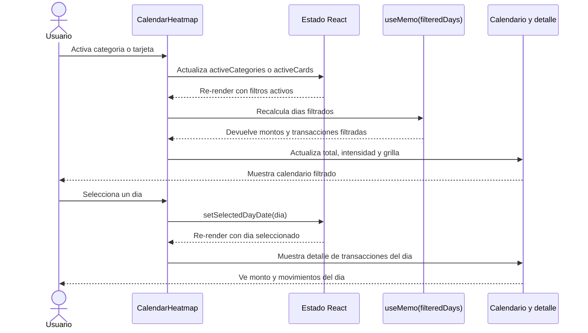
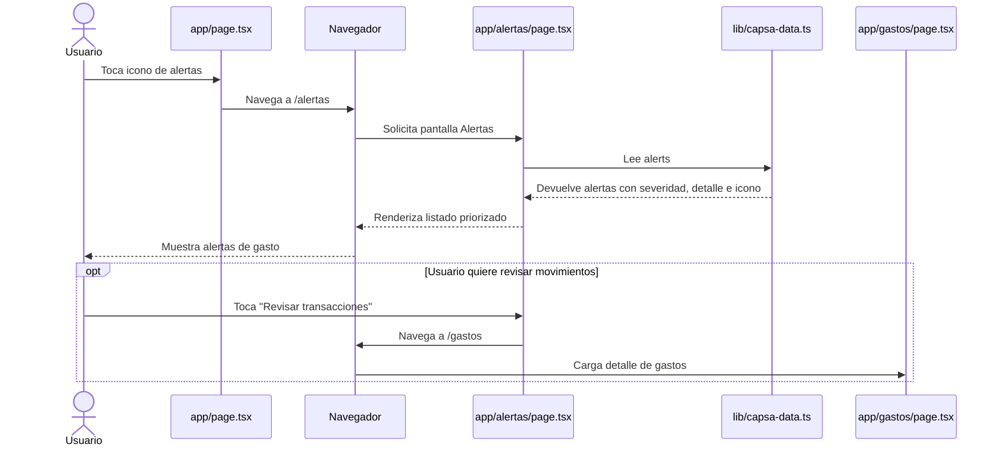
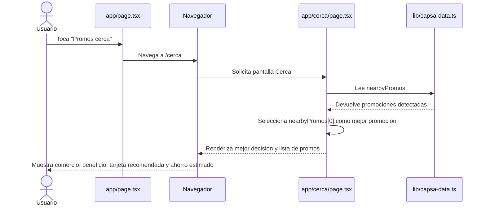
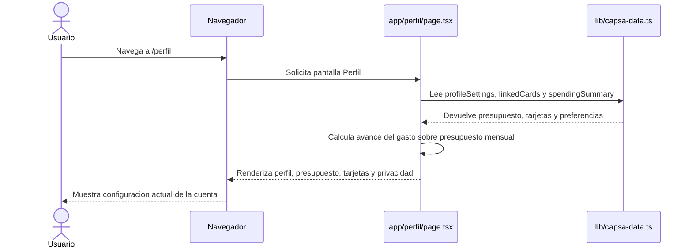

# Diagramas de secuencia - CapsaAI

Estos diagramas representan los flujos actuales de la app. La implementacion usa componentes de Next.js y datos locales desde `lib/capsa-data.ts`; no hay API externa ni base de datos en el estado actual del proyecto.

## 1. Carga del inicio

## 2. Filtrar suscripciones por tarjeta

## 3. Consulta de gastos y calendario

## 4. Filtros y seleccion de dia en calendario

## 5. Revision de alertas

## 6. Promociones cercanas

## 7. Perfil, presupuesto y preferencias

