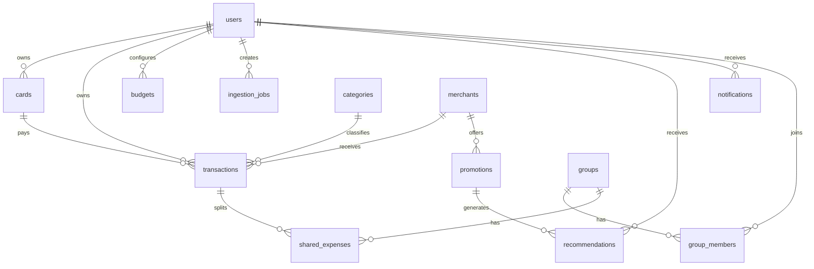

# Modelo de datos inicial - CapsaAI

Actualizacion: el modelo operativo ya quedo implementado en `prisma/schema.prisma`, con migracion inicial en `prisma/migrations/20260727000000_init/migration.sql`, migracion de nombres fisicos en español en `prisma/migrations/20260727002000_spanish_database_names/migration.sql` y seed en `prisma/seed.ts`.

Este documento queda como referencia conceptual historica. Para nombres reales de tablas y columnas usar `prisma/schema.prisma` y `docs/base-datos.md`.

## Entidades principales

## users

| Campo | Tipo sugerido | Nota |
| --- | --- | --- |
| id | uuid | PK |
| email | text | Unico |
| password_hash | text | Null si luego se agrega login social |
| full_name | text | Nombre visible |
| phone_e164 | text | Para WhatsApp, formato +54 |
| country | text | Default AR |
| currency | text | Default ARS |
| timezone | text | Default America/Argentina/Buenos_Aires |
| status | enum | active, disabled, deleted |
| created_at | timestamptz | Auditoria |
| updated_at | timestamptz | Auditoria |
| deleted_at | timestamptz | Baja logica |

## user_preferences

| Campo | Tipo sugerido | Nota |
| --- | --- | --- |
| id | uuid | PK |
| user_id | uuid | FK users |
| notification_channels | jsonb | push, whatsapp, email |
| alert_threshold_percent | int | Ejemplo: 85 |
| location_promos_enabled | boolean | Requiere consentimiento |
| pattern_alerts_enabled | boolean | Alertas por habitos |
| duplicate_detection_enabled | boolean | Duplicados |
| data_retention_days | int | Politica futura |

## cards

| Campo | Tipo sugerido | Nota |
| --- | --- | --- |
| id | uuid | PK |
| user_id | uuid | FK users |
| issuer_bank | text | Galicia, Santander, BBVA |
| brand | text | Visa, Mastercard, Amex |
| card_type | enum | credit, debit, prepaid |
| last_four | text | Nunca guardar PAN completo |
| alias | text | Nombre editable |
| active | boolean | Baja logica |
| created_at | timestamptz | Auditoria |

## categories

| Campo | Tipo sugerido | Nota |
| --- | --- | --- |
| id | uuid | PK |
| user_id | uuid | Null para categorias globales |
| key | text | super, comida, transporte |
| name | text | Nombre visible |
| color | text | Hex |
| icon | text | Nombre de icono UI |
| parent_id | uuid | Para subcategorias |
| active | boolean | Baja logica |

## merchants

| Campo | Tipo sugerido | Nota |
| --- | --- | --- |
| id | uuid | PK |
| name | text | Nombre normalizado |
| raw_names | jsonb | Variantes detectadas |
| category_id | uuid | Categoria default |
| country | text | AR |
| location | geography/jsonb | Opcional |
| source | text | manual, scraper, maps |

## transactions

| Campo | Tipo sugerido | Nota |
| --- | --- | --- |
| id | uuid | PK |
| user_id | uuid | FK users |
| card_id | uuid | FK cards, nullable |
| category_id | uuid | FK categories |
| merchant_id | uuid | FK merchants, nullable |
| amount_cents | bigint | Evitar decimales |
| currency | text | ARS |
| occurred_at | timestamptz | Fecha del gasto |
| description | text | Texto del usuario o comprobante |
| source | enum | manual, whatsapp, receipt, email, import |
| status | enum | pending_confirmation, confirmed, rejected |
| confidence | numeric | Confianza de extraccion/categoria |
| duplicate_of_id | uuid | FK transactions, nullable |
| created_at | timestamptz | Auditoria |
| updated_at | timestamptz | Auditoria |
| deleted_at | timestamptz | Baja logica |

## ingestion_jobs

| Campo | Tipo sugerido | Nota |
| --- | --- | --- |
| id | uuid | PK |
| user_id | uuid | FK users |
| channel | enum | app, whatsapp, email |
| input_type | enum | text, image, pdf, audio |
| raw_text | text | Texto recibido |
| file_url | text | Storage externo |
| status | enum | received, processing, processed, failed |
| extracted_payload | jsonb | Monto, fecha, comercio, categoria |
| error_message | text | Error si falla |
| created_at | timestamptz | Auditoria |
| processed_at | timestamptz | SLA menor a 3 minutos |

## budgets

| Campo | Tipo sugerido | Nota |
| --- | --- | --- |
| id | uuid | PK |
| user_id | uuid | FK users |
| category_id | uuid | Nullable para presupuesto total |
| period | text | YYYY-MM |
| limit_cents | bigint | Limite |
| alert_threshold_percent | int | Umbral |
| created_at | timestamptz | Auditoria |

## subscriptions

| Campo | Tipo sugerido | Nota |
| --- | --- | --- |
| id | uuid | PK |
| user_id | uuid | FK users |
| merchant_id | uuid | FK merchants |
| card_id | uuid | FK cards, nullable |
| amount_cents | bigint | Monto esperado |
| frequency | enum | weekly, monthly, yearly |
| next_expected_at | date | Proximo cobro |
| status | enum | suspected, active, dismissed, cancelled |
| confidence | numeric | Confianza |

## promotions

| Campo | Tipo sugerido | Nota |
| --- | --- | --- |
| id | uuid | PK |
| title | text | Titulo visible |
| merchant_id | uuid | FK merchants, nullable |
| issuer_bank | text | Banco aplicable |
| card_brand | text | Marca aplicable |
| card_type | text | Tipo aplicable |
| category_id | uuid | Rubro |
| benefit_type | enum | discount, cashback, installments, two_for_one |
| benefit_value | numeric | Porcentaje, cuotas o valor |
| cap_cents | bigint | Tope si aplica |
| valid_from | date | Inicio |
| valid_until | date | Fin |
| weekdays | int[] | Dias aplicables |
| conditions | text | Restricciones |
| source | text | scraper, api, manual |
| source_url | text | URL origen |
| status | enum | active, expired, disabled |

## recommendations

| Campo | Tipo sugerido | Nota |
| --- | --- | --- |
| id | uuid | PK |
| user_id | uuid | FK users |
| promotion_id | uuid | FK promotions, nullable |
| type | enum | budget_alert, promo_match, habit_change, subscription, cheaper_option |
| title | text | Titulo |
| detail | text | Explicacion |
| estimated_saving_cents | bigint | Ahorro estimado |
| score | numeric | Ranking |
| status | enum | new, viewed, applied, dismissed |
| created_at | timestamptz | Auditoria |

## groups, group_members y shared_expenses

| Tabla | Campos clave | Nota |
| --- | --- | --- |
| groups | id, name, owner_user_id, created_at | Grupo de gastos compartidos |
| group_members | id, group_id, user_id, role, status | Permisos y membresia |
| shared_expenses | id, group_id, transaction_id, paid_by_user_id, split_method, splits_json | Division del gasto |

## Indices minimos

- `transactions(user_id, occurred_at)`
- `transactions(user_id, category_id, occurred_at)`
- `transactions(user_id, card_id, occurred_at)`
- `transactions(user_id, merchant_id, occurred_at)`
- `ingestion_jobs(status, created_at)`
- `promotions(status, valid_until)`
- `recommendations(user_id, status, created_at)`
- `group_members(user_id, group_id)`

## Reglas de seguridad de datos

- Nunca guardar numero completo de tarjeta.
- Todo acceso a `transactions`, `cards`, `budgets`, `recommendations` y `notifications` debe filtrar por `user_id`.
- Los gastos compartidos solo deben ser visibles para miembros activos del grupo.
- Los adjuntos deben usar URLs firmadas o acceso proxy autenticado.
- Email, telefono y tokens OAuth deben tratarse como datos sensibles.
